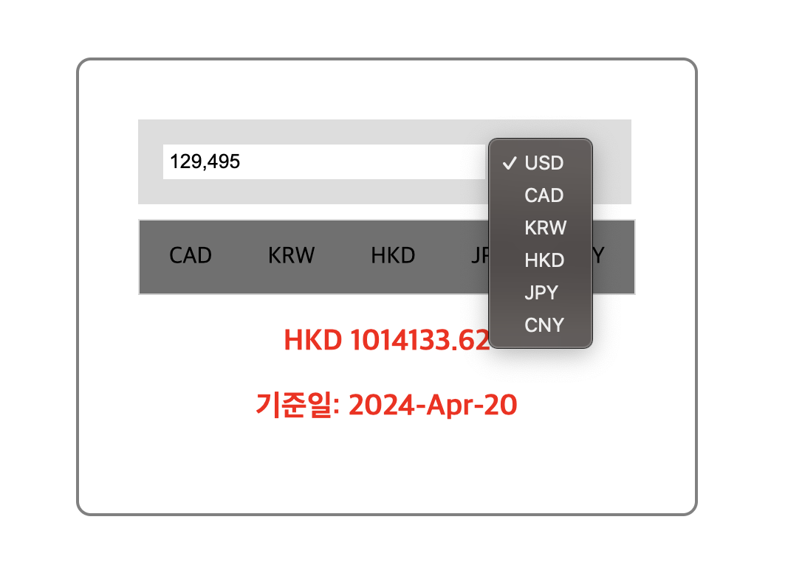

# 환율 변환 서비스 개발 

⚒️ Stacks 
- React 
- Redux 
- Axios 
- Style-Components 
 
⚠️ Conditions 
- 숫자 입력 시, 자릿수 3개씩 콤마(,)로 구분해줄 것.  
- 입력창 옆 드롭다운에서, 특정 통화를 선택할 경우, 아래 탭 메뉴에서는 제외되고 나머지 통화만을 표시할 것.  
- 환율 정보는 소수점 둘째자리까지 표시할 것.  
- 기준일 날짜 포맷은 다음과 같이 포맷할 것.(2022-Jan-01)
- Redux를 활용하여 전역상태관리를 포함할 것. 

 
📷 Result 

